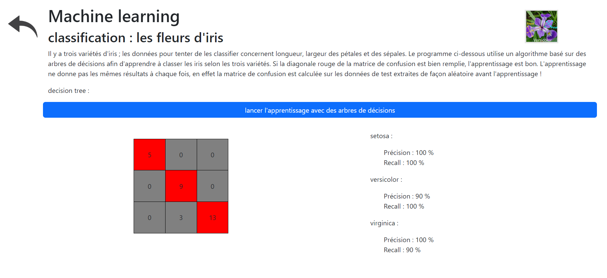
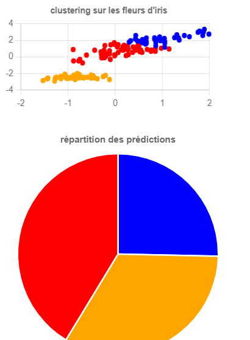
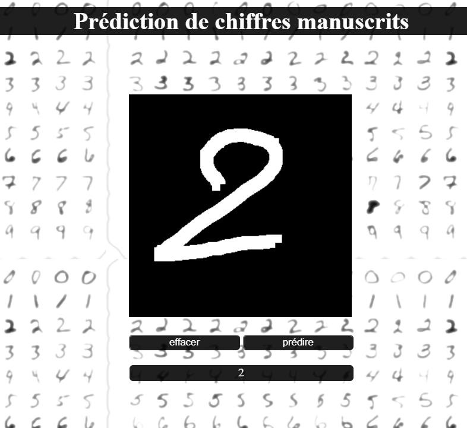
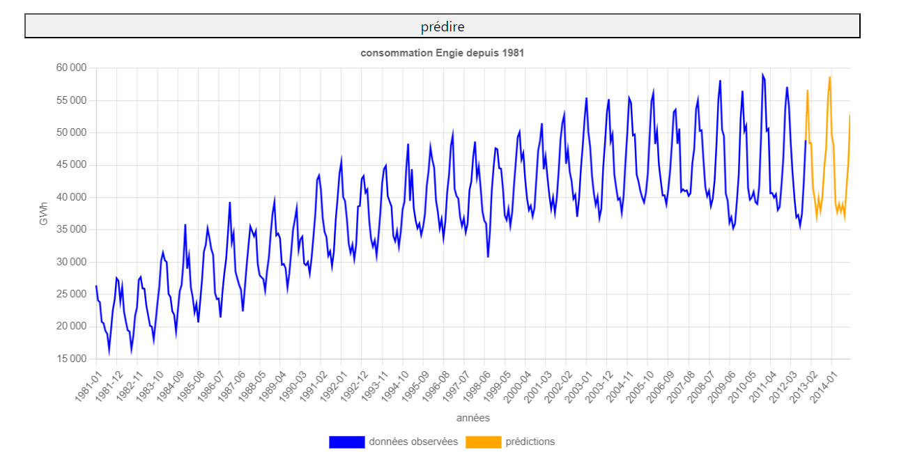
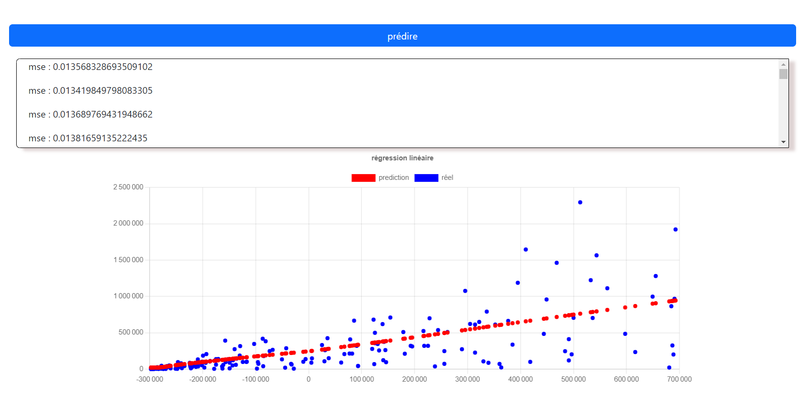

# Machine learning avec javaScript ! 

[Démo](https://erwan-diato.com/ml/index.php)

Cette application web montre des utilisations possibles, simples, de l'intelligence artificielle avec javaScript. Les technologies suivantes sont utilisées :   

- NodeJs  
- express  
- mocha (pour les tests en back-end)  
- scikitJs  
- tensorflowJs  
- pca-js  
- ejs (pour le templating front-end)

Les modèles avec scikitJs sont utilisés en back-end, ceux avec tensorFlowJs sont utilisés en front-end.  

Les cas d'usages sont décrits ci-dessous.  


## Arbres de décision

Apprentissage sur le dataset des fleurs d'iris. 



## clustering  

Utilisation de l'algorithme KMeans sur l'ensemble du dataset des fleurs d'iris. Les graphiques sont réalisés avec ChartJs.



## classification d'images  

Un modèle de réseaux de neurones à convolutions est entraîné* pour reconnaitre des chiffres manuscrits sur
le jeu de données mnist. 60000 images sont utilisées pour l'entraînement. Le modèle est converti au format Tensorflow Js.   

Un canvas html permet de tester le modèle : écrire un chiffre avec la souris et effectuer la prédiction.   



* j'ai entraîné ce modèle from scratch en python avec TensorFlow-keras. Il est ensuite converti au format TensorflowJs. Ce modèle peut être librement partagé. L'accuracy sur les données de test est de 96%, sur les données d'entraînement de 98%. Precision et Recall n'ont pas été évalués. La matrice de confusion n'a pas été calculée.  


## prédiction de série temporelle

Prédiction de la consommation électrique en France d'après les données en opendata d'Engie. Ce modèle est entraîné en python, la prédiction se fait côté front-end avec TensorflowJs. Le modèle utilisé est un réseau de neurones récurrent.



## régressions linéaire, non linéaire  

Une page sur les régression avec TensorflowJs, avec expérience utilisateur qui permet de modifier le nombre de variables, le nombre de données, l'optimiseur, la fonction d'activation de la couche cachée du réseau de neurones, le nombre d'epochs, et permet d'effectuer une transformation polynomiale des données.   

L'affichage grapqhique se fait alors avec ChartJs, comprenant une réduction de dimensionnalité (PCA) afin de pouvoir avoir un affichage en 2d.

  

J'ai écrit les classes scaler et polynomialFeatures, la classe PCA est issue du package npm pca-js écrit par Bitan Nath, et simplement copié pour une utilisation front-end. 

## installation  

``` bash
npm install
```

## effectuer les tests 

```bash
npm run test
```  

## lancement du serveur  

```bash
nodemon index.js
```
L'application est disponible à l'adresse suivante :

> http://localhost:8080/


